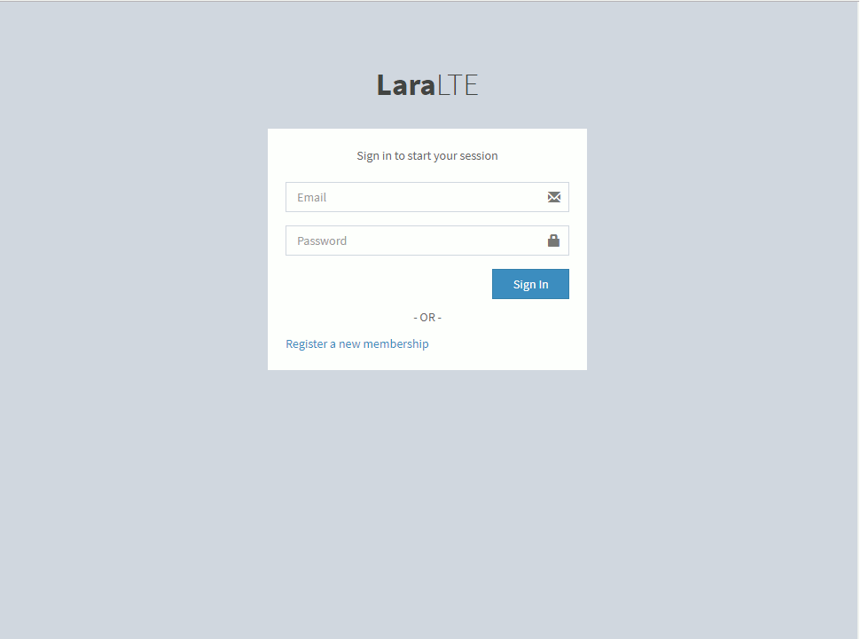

# LaraLTE
A laravel admin panel boilerplate using [AdminLTE](https://adminlte.io)

# Installation
1. Clone the repo and cd into it
2. ```composer install```
3. Rename ``.env.example`` to ``.env``
3. ```php artisan key:generate```
4. Create a database and set the credentials in ```.env``` file
5. ```php artisan migrate```
6. If you are using XAMPP, visit ```localhost/laralte/public/``` in your browser OR ```php artisan serve``` and visit ```http://127.0.0.1:8000```
